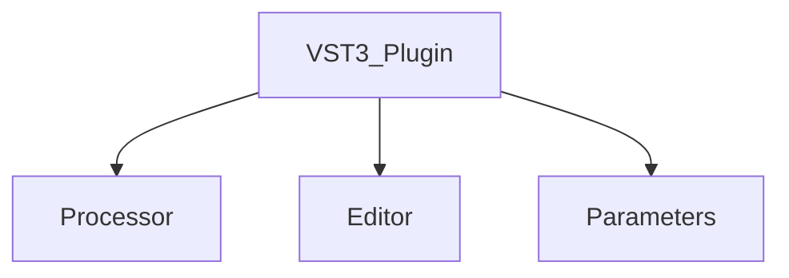
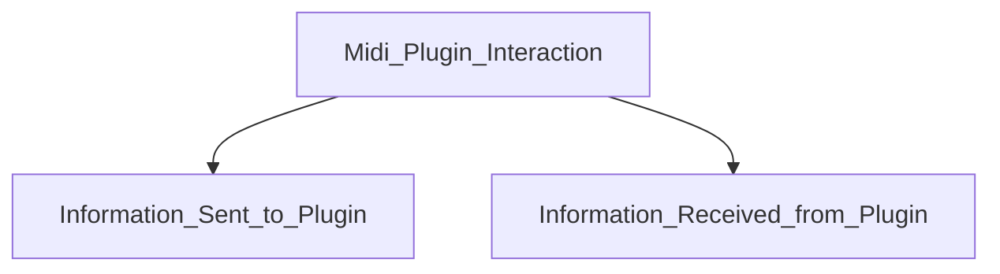
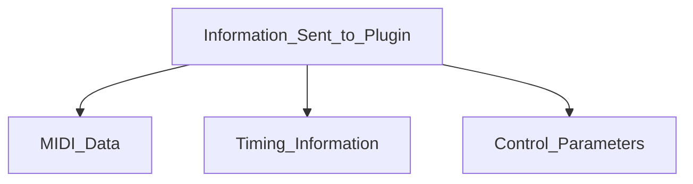
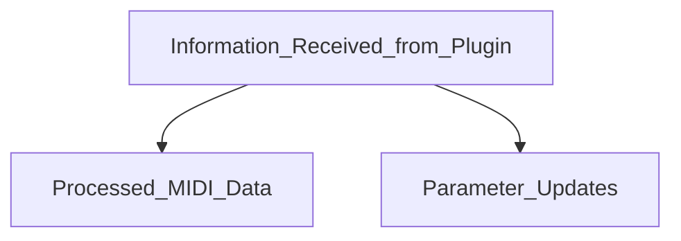
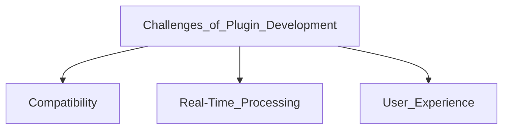
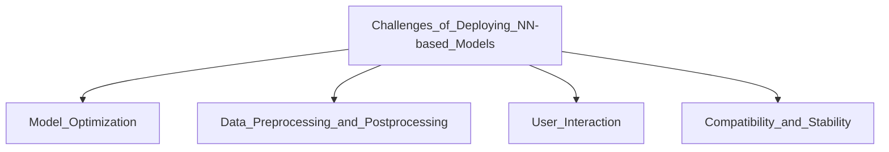

# Plugin Basics
{: .no_toc }

In this section, we will provide a brief guide on general VST plugin architecture and how a plugin interacts with the host
{: .fs-6 .fw-300 }

## Table of contents
{: .no_toc .text-delta }

1. TOC
{:toc}

[Get started now](#getting-started){: .btn .btn-primary .fs-5 .mb-4 .mb-md-0 .mr-2 }

[View it on GitHub][Just the Docs repo]{: .btn .fs-5 .mb-4 .mb-md-0 }

---

## VST3 Plugin Architecture

### Processor
The processor is the core of any VST3 plugin, responsible for audio and MIDI processing. 
It's the part that performs the actual computations on the incoming audio/midi, manipulating it according to the parameters set by the user or the host application. 

The communication between a VST3 plugin and a compatible host is done on a per-buffer basis. 
In the processor thread, the host provides a buffer of audio/midi data to the plugin, and the plugin is expected to process the data and return a buffer of audio/midi data back to the host.
The processing is done in a per-buffer basis, and the plugin is expected to process the data within a limited amount of time, as the processing method 
is called repeatedly by the host as soon as a new buffer of data is available.
Given the limited amount of time available to process the data, there is only so much that can be done within the processing method.
As a result, intensive computations (such as generation using a neural network) must be carried out in the background using a separate thread.

In addition to MIDI and audio data, the host also provides the plugin with information about the current state of the plugin, such as the current value of each parameter, the playhead position, 
sample rate, meter, time signature and so on. Given that the data is not provided per-sample (but rather per-buffer), the smallest resolution at which  
these data is available is the buffer size. 

Using the playhead information, the plugin can determine the current position in the timeline. This position is 
relative to the start of the timeline and can be accessed in different time units:

- **Samples**: The number of samples since the start of the timeline.
- **Seconds**: The number of seconds since the start of the timeline.
- **Quarter Notes**: The number of quarter notes since the start of the timeline.

With respect to MIDI data within a buffer, the host provides the exact location of the event within the buffer. 
That said, this location is always specified in **samples relative to the start of the buffer**.

Depending on what sort of timing a generative model requires, a developer should use the provided timing information to calculate the appropriate timing for the model.

{: .note }
> If you want to learn more about VST3 plugin development using JUCE, check out the 
> following tutorial provided by [Eyal Amir](https://github.com/eyalamirmusic) on the [The Audio Programmer](https://www.youtube.com/@TheAudioProgrammer) YouTube channel:
> <iframe width="560" height="315" src="https://www.youtube.com/embed/tgf6J8foCiw" title="YouTube video player" frameborder="0" allow="accelerometer; autoplay; clipboard-write; encrypted-media; gyroscope; picture-in-picture; web-share" allowfullscreen></iframe>
> 

### Editor
The editor in a VST3 plugin represents the graphical user interface (UI). It's what the user interacts with when adjusting parameters and settings. 

#### Graphical Elements
Creating an engaging and intuitive user interface requires careful design of graphical elements. These can include knobs, sliders, buttons, and displays, each corresponding to a specific parameter in the plugin. The graphical design not only affects the user's experience but also represents the branding and professionalism of the plugin.

#### Parameter Mapping
Parameter mapping bridges the graphical elements with the internal parameters of the plugin. When a user moves a slider or turns a knob, it translates into a change in the sound or behavior of the plugin. This dynamic interaction requires careful mapping and synchronization to ensure that the UI accurately reflects the state of the plugin.

### Parameters
Parameters in a VST3 plugin define the variables that control its operation. They are the essential connection between the user's actions and the plugin's response.

#### Preset Management
Preset management allows users to save and recall specific settings, known as presets. This feature is vital for workflow efficiency, enabling users to quickly switch between different configurations and reuse them across various projects.

#### Automation
Automation refers to the ability of the host to control plugin parameters automatically over time. It's a key feature in modern music production, allowing for dynamic changes within a track, such as a gradual increase in reverb or a sudden filter sweep.

### Midi Only Plugins
MIDI-only plugins in VST3 offer specialized functionalities for handling MIDI data without audio processing. These plugins can range from simple tools that filter or route MIDI data to complex systems that generate entire compositions algorithmically. The VST3 architecture supports these MIDI-centric use cases efficiently, providing a robust framework for development.

----
## Midi Plugin Interaction with Host
The interaction between a MIDI plugin and its host application is a two-way communication involving several types of information.

### Information Sent to Plugin
The host sends various types of information to the plugin to guide its operation.

### Information Received from Plugin
The plugin can also send information back to the host.

#### MIDI Data
This includes all the MIDI messages like note on/off, pitch bend, control changes, and more. The plugin may use this data to generate sound, apply effects, or even create visualizations.

#### Timing Information
Accurate timing information from the host ensures that the plugin operates in sync with other elements of a project. Whether it's keeping a virtual drum machine in time with a track or synchronizing a delay effect, timing is a fundamental aspect of musical coherence.

#### Control Parameters
These are specific settings and controls that the user or host can define to modify the behavior of the plugin. They allow for intricate control and fine-tuning, aligning the plugin's functionality with the creative intent of the user.

### Information Received from Plugin
The plugin can also send information back to the host. This includes processed MIDI data, updated parameters, or even metadata like plugin state and configuration.

#### Processed MIDI Data
Once the plugin processes the MIDI data, it may send it back to the host with alterations, such as new notes generated by an arpeggiator or modified velocities from a dynamics processor.

#### Parameter Updates
As the plugin operates, it may need to communicate changes in its parameters back to the host. This ensures that any automated controls or host displays remain in sync with the plugin's internal state.

---
## Challenges of Plugin Development
VST3 plugin development, while offering powerful capabilities, presents its own set of challenges. 

### Compatibility
Creating a plugin that functions seamlessly across different host applications, operating systems, and hardware configurations requires careful planning and extensive testing. VST3 offers some standardization, but developers still need to account for various peculiarities and potential conflicts within different hosts.

### Real-Time Processing
Ensuring that a plugin can process audio or MIDI in real time without introducing latency or glitches is a complex task. It involves optimizing algorithms, managing resources, and handling multithreading properly to provide a smooth user experience.

### User Experience
Designing a user interface that is both visually appealing and functional is an art form in itself. A good UI should provide intuitive access to all of the plugin's features, offer clear visual feedback, and align with the expectations and needs of its users.
---
## Challenges of Deploying NN-based Generative Models of Symbolic Music as VST3 Plugins
Deploying Neural Network (NN) based generative models within VST3 plugins adds layers of complexity and introduces unique challenges.

### Model Optimization
NN models can be computationally intensive. Ensuring that they run efficiently within a plugin, especially in a real-time context, requires careful optimization. This includes choosing the right architecture, reducing the model size, and leveraging hardware acceleration where possible.

### Data Preprocessing and Postprocessing
Handling the conversion between raw MIDI data and the specific format required by the generative models is a complex task. It requires careful mapping, scaling, and encoding, all of which must be done in real time without introducing latency or errors.

### User Interaction
Creating an intuitive interface for interacting with complex NN-based models can be a significant challenge. Users need to be able to control the generative process without getting lost in technical details. This may require innovative UI design and clear visualization of complex data.

### Compatibility and Stability
Ensuring compatibility and stability with various hosts and platforms becomes even more complex when dealing with NN models. Different systems may have varying support for the underlying technologies required to run the models, and developers must account for these variations to ensure a smooth user experience.
