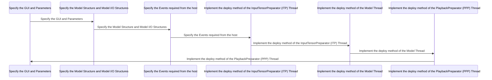

# Implementation Check List
{: .no_toc }

Explain what this section is about
{: .fs-6 .fw-300 }

## Table of contents
{: .no_toc .text-delta }

1. TOC
{:toc}

---

Use this checklist to make sure that you have implemented all the necessary steps to deploy your model! 

- [ ] Step 1: Specify the GUI and Parameters
- [ ] Step 2: Specify the Model Structure and Model I/O Structures
- [ ] Step 3: Specify the Events required from the host
- [ ] Step 4: Implement the deploy method of the InputTensorPreparator (ITP) Thread
- [ ] Step 5: Implement the deploy method of the Model Thread
- [ ] Step 6: Implement the deploy method of the PlaybackPreparator (PPP) Thread