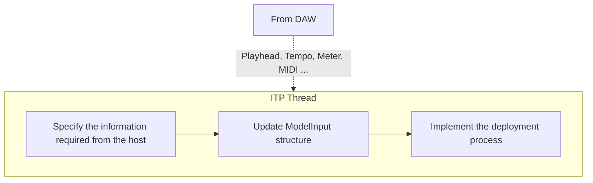

# Input Preparation
{: .no_toc }

{: .fs-6 .fw-300 }

## Table of contents
{: .no_toc .text-delta }

1. TOC
{:toc}


---

## Overview
Prior to running the inference on a given model, all or some of the host's play-head information,
incoming MIDI messages, and possibly parameters controlled via a graphical interface must be 
reformatted according to a given model`s input requirements. `ITP` thread is responsible for
this task.

In this thread, all necessary information is sequentially provided to carry out the tokenization 
(or representation) of the 
relevant symbolic information into a tensor-like format. 




## Specification of the Information Required from the Host

Depending on the task at hand, the type of information as well as the frequency at which they are 
required may vary. For instance, in the case of a model that only requires the onset of notes with 
their corresponding time-stamp, the `ITP` thread will only require the Note On MIDI Messages. On the
other hand, for a model that requires the full MIDI messages as well as bar/beat, meter information, the
`ITP` thread will require to receive extra information from the host (namely, the MIDI messages and 
the bar/beat information). NeuralMidiFx allows you to easily specify the subset of 
the information you need from the host.

{: .note }
> Edit the [`Config_HostEvents.h` file]({{ site.baseurl }}/docs/DeploymentThreads/Config_HostEvents) to specify the information required from the host.


### Available Events
In this context, an event is a piece of information that is sent to the `ITP` thread notifying it of a
change in the host`s state or a new incoming MIDI message.

The available events are:

- `FirstBufferEvent` --> The very first event sent by the host when the playhead starts.
This event is useful to figure out when the host starts playing.
- `PlaybackStoppedEvent` --> The event sent by the host as soon as the playhead stops. 
This event is useful to figure out when the host stops playing.
- `NewBufferEvent` --> The event sent by the host at the beginning of every new buffer (if playhead is running).
In case you have a specific model that requires to know the position of the playhead at any given time, 
use this event. (See [Plugin Basics]({{ site.baseurl }}/docs/PluginBasics/#processor) chapter if you are not familiar with the concept of buffer)
- `NewBarEvent` --> The event sent by the host at the beginning of every new bar (if playhead is running).
In case you use bar locations in your tokenization process, use this event.
- `NewTimeShiftEvent` --> The event sent by the host every N quarter notes (if playhead is running).
In case you use specific locations (such as every beat, every 16th note, etc.) in your tokenization process,
use this event. 
- `NoteOnEvent` --> The event sent by the host when a note is played.
- `NoteOffEvent` --> The event sent by the host when a note is released.
- `CCEvent` --> The event sent by the host when a CC message is received.

For every event, regardless of its type, the following information is available:
- `qpm` --> The tempo of the host at the time of the event
- `meter` --> The meter of the host at the time of the event
- `barCount` --> Number of bars since the beginning of the host at the time of the event
- `lastBarPos` --> Position of last bar (in quarter notes, seconds and samples) since the beginning of the host at the time of the event 

{: .note }
> Refer to [here](https://github.com/behzadhaki/NeuralMidiFXPlugin/blob/master/NeuralMidiFXPlugin/NeuralMidiFXPlugin/ITP_Deploy.cpp#L70C1-L107) for learning how to use, extract and access the information from the events.

### Modifying `Config_HostEvents.h`
```c++
           
// ======================================================================================
// ==================        EventFromHost Communication Settings        ================
// ======================================================================================
/*
 * You can send Events to ITP at different frequencies with different
 *      intentions, depending on the usecase intended. The type and frequency of providing
 *      these events is determined below.
 *
 *      Examples:
 *      1. If you need these information at every buffer, then set
 *
 *      >> constexpr bool SendEventAtBeginningOfNewBuffers_FLAG{true};
 *      >> constexpr bool SendEventForNewBufferIfMetadataChanged_FLAG{false};
 *
 *      2. Alternatively, you may want to access these information,
 *      only when the metadata changes. In this case:
 *
 *      >> constexpr bool SendEventAtBeginningOfNewBuffers_FLAG{true};
 *      >> constexpr bool SendEventForNewBufferIfMetadataChanged_FLAG{false};
 *
 *      3. If you need these information at every bar, then:
 *
 *      >> constexpr bool SendNewBarEvents_FLAG{true};
 *
 *      4. If you need these information at every specific time shift periods,
 *      you can specify the time shift as a ratio of a quarter note. For instance,
 *      if you want to access these information at every 8th note, then:
 *
 *      >>  constexpr bool SendTimeShiftEvents_FLAG{false};
 *      >>  constexpr double delta_TimeShiftEventRatioOfQuarterNote{0.5};
 *
 *      5. If you only need this information, whenever a new midi message
 *      (note on/off or cc) is received, you don`t need to set any of the above,
 *      since the metadata is embedded in any midi EventFromHost. Just remember to not
 *      filter out the midi events.
 *
 *      >>  constexpr bool FilterNoteOnEvents_FLAG{false};
 *      and/or
 *      >>  constexpr bool FilterNoteOffEvents_FLAG{false};
 *      and/orzX
 *      >>  constexpr bool FilterCCEvents_FLAG{false};
 *
 */
 
namespace event_communication_settings {
    // set to true, if you need to send the metadata for a new buffer to the ITP thread
    constexpr bool SendEventAtBeginningOfNewBuffers_FLAG{true};
    constexpr bool SendEventForNewBufferIfMetadataChanged_FLAG{true};     // only sends if metadata changes

    // set to true if you need to notify the beginning of a new bar
    constexpr bool SendNewBarEvents_FLAG{true};

    // set to true EventFromHost for every time_shift_event ratio of quarter notes
    constexpr bool SendTimeShiftEvents_FLAG{false};
    constexpr double delta_TimeShiftEventRatioOfQuarterNote{0.5}; // sends a time shift event every 8th note

    // Filter Note On Events if you don`t need them
    constexpr bool FilterNoteOnEvents_FLAG{false};

    // Filter Note Off Events if you don`t need them
    constexpr bool FilterNoteOffEvents_FLAG{false};

    // Filter CC Events if you don`t need them
    constexpr bool FilterCCEvents_FLAG{false};
}
```

## Implementation of Input Preparation Process

## Sending the Prepared Input to the Model Thread using the `ModelInput` Structure