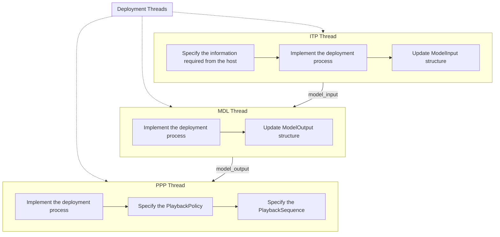

# Deployment Threads
{: .no_toc }

---

NeuralMidiFx dedicates three threads respectively for preparing the inputs of a model (`InputTensorPreparator` thread, a.k.a `ITP`), 
running inference (`Model` thread, a.k.a `MDL`), and reformatting the generations into MIDI messages for playback 
via the host  (`PlaybackPreparator` thread, a.k.a `PPP`).

In these threads, the wrapper provides a set of utilities for easily receiving and sending information from/to the 
threads via the previously implemented inter-thread communication pipelines. 

