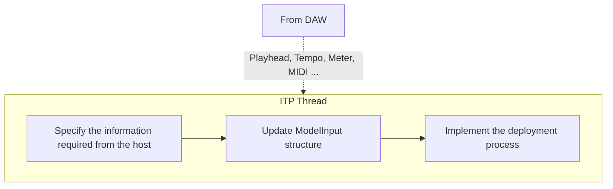

# Input Tensor Preparator Thread (ITP)
{: .no_toc }

{: .fs-6 .fw-300 }

## Table of contents
{: .no_toc .text-delta }

1. TOC
{:toc}

---

## Overview
Prior to running the inference on a given model, all or some of the host's play-head information,
incoming MIDI messages, and possibly parameters controlled via a graphical interface must be 
reformatted according to a given model's input requirements. `ITP` thread is responsible for
this task.

In this thread, all necessary information is sequentially provided to carry out the tokenization 
(or representation) of the 
relevant symbolic information into a tensor-like format. 

Depending on the task at hand, the type of information as well as the frequency at which they are 
required may vary. For instance, in the case of a model that only requires the onset of notes with 
their corresponding time-stamp, the `ITP` thread will only require the play-head information. On the
other hand, for a model that requires the full MIDI messages as well as bar/beat, meter information, the
`ITP` thread will require to receive extra information from the host (namely, the MIDI messages and 
the bar/beat information). NeuralMidiFx you to easily specify the subset of 
the information you need from the host.

## Specification of the Information Required from the Host
## Implementation of Input Preparation Process
## Sending the Prepared Input to the Model Thread using the `ModelInput` Structure