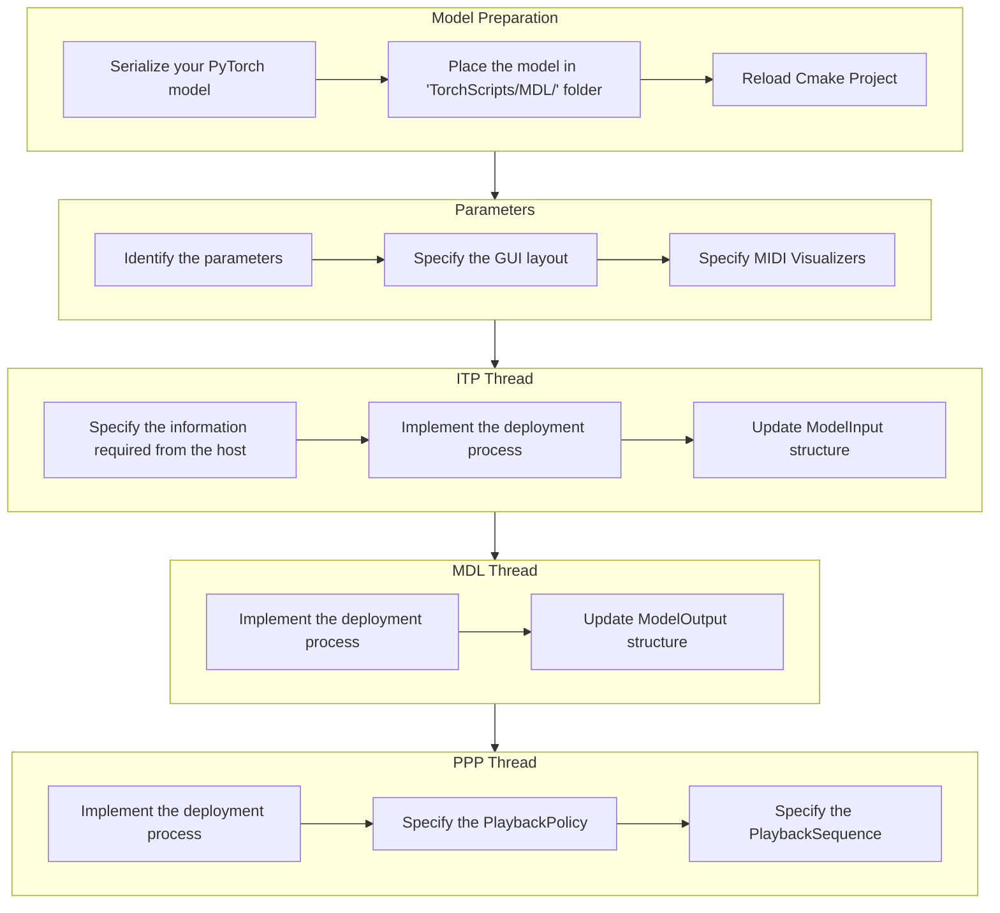

# Implementation Check List
{: .no_toc }

Use this checklist to make sure that you have implemented all the necessary steps to deploy your model!

{: .fs-6 .fw-300 }

## Table of contents
{: .no_toc .text-delta }

1. TOC
{:toc}

---

- [ ] [Model Preparation]({{ site.baseurl }})
  - [ ] [Serialize your PyTorch model]({{ site.baseurl }})
  - [ ] Place the model in "TorchScripts/MDL/" folder (within the project) 
  - [ ] Reload Cmake Project (see note below)
- [ ] Parameters
  - [ ] Identify the parameters
  - [ ] Specify the GUI layout
  - [ ] Specify MIDI Visualizers (if any)
- [ ] ITP Thread
  - [ ] Specify the information required from the host
  - [ ] Implement the deployment process
  - [ ] Update ModelInput structure
- [ ] MDL Thread
  - [ ] Implement the deployment process
  - [ ] Update ModelOutput structure 
- [ ] PPP Thread
  - [ ] Implement the deployment process
  - [ ] Specify the PlaybackPolicy
  - [ ] Specify the PlaybackSequence

{: .note}
> Anytime you update the content of the "TorchScripts" folder, you need to reload the CMAKE project.
> 
> 

