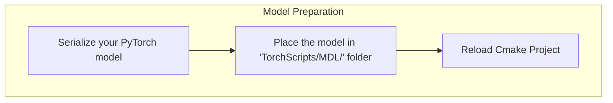
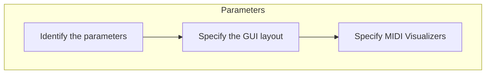
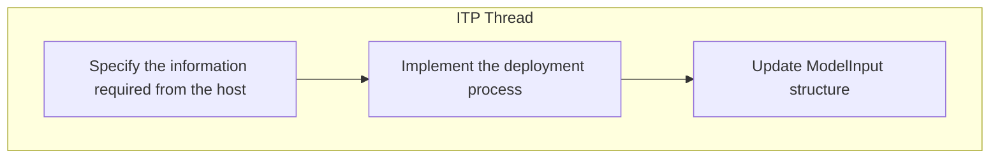
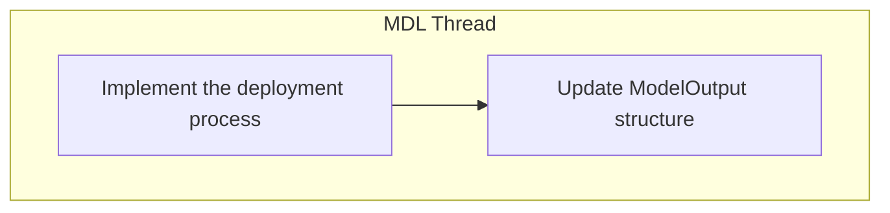
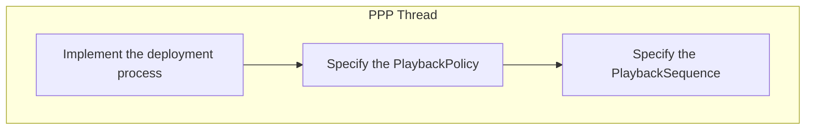

# Implementation Check List
{: .no_toc }

Use this checklist to make sure that you have implemented all the necessary steps to deploy your model!

{: .fs-6 .fw-300 }

## Table of contents
{: .no_toc .text-delta }

1. TOC
{:toc}

---

## Step 1 - Model Preparation
- [ ] [Model Preparation]({{ site.baseurl }}/docs/ModelPreparation)
  - [ ] [Serialize your PyTorch model]({{ site.baseurl }}/docs/ModelPreparation/Serialization)
  - [ ] [Place the model in "TorchScripts/MDL/" folder (within the project)]({{ site.baseurl }}/docs/ModelPreparation/ImportingYourSerializedModels/#step-1-add-your-serialized-model-to-the-project) 
  - [ ] [Reload Cmake Project (see note below)]({{ site.baseurl }}/docs/ModelPreparation/ImportingYourSerializedModels/#step-2-reload-the-cmake-project) 

## Step 2 - Parameters

- [ ] [Parameters]({{ site.baseurl }}/docs/GraphicalInterface)
  - [ ] [Identify the parameters]({{ site.baseurl }}/docs/GraphicalInterface/#step-1-available-user-interface-elements)
  - [ ] [Specify the GUI layout]({{ site.baseurl }}/docs/GraphicalInterface/#step-2-define-the-ui-elements)
  - [ ] Specify [MIDI In]({{ site.baseurl }}/docs/GraphicalInterface/#step-4-midi-in-widget) or [MIDI Out]({{ site.baseurl }}/docs/GraphicalInterface/#step-5-midi-out-widget) Visualizers (if any)

# Step 3 - InputTensorPreparator Thread (ITP)
- [ ] ITP Thread
  - [ ] Specify the information required from the host
  - [ ] Implement the deployment process
  - [ ] Update ModelInput structure

# Step 4 - Model Thread (MDL)
- [ ] MDL Thread
  - [ ] Implement the deployment process
  - [ ] Update ModelOutput structure

# Step 5 - PlaybackPreparator Thread (PPP)
- [ ] PPP Thread
  - [ ] Implement the deployment process
  - [ ] Specify the PlaybackPolicy
  - [ ] Specify the PlaybackSequence

