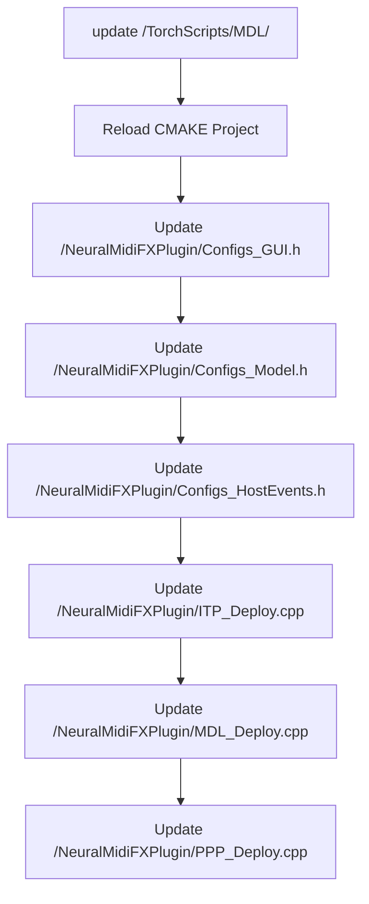

# Implementation Check List
{: .no_toc }

Use this checklist to make sure that you have implemented all the necessary steps to deploy your model!

{: .fs-6 .fw-300 }

## Table of contents
{: .no_toc .text-delta }

1. TOC
{:toc}

---

- [ ] Place your serialize libtorch model in "TorchScripts/MDL/" folder (within the project) 
  - [ ] Reload Cmake Project (see note below)
- [ ] Specify the GUI and Parameters
- [ ] Specify the Model Structure and Model I/O Structures
- [ ] Specify the Events required from the host
- [ ] Implement the deploy method of the InputTensorPreparator (ITP) Thread
- [ ] Implement the deploy method of the Model Thread
- [ ] Implement the deploy method of the PlaybackPreparator (PPP) Thread

{: .note}
> Anytime you update the content of the "TorchScripts" folder, you need to reload the CMAKE project.
> 
> 

