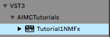
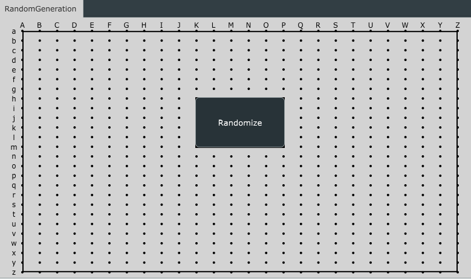
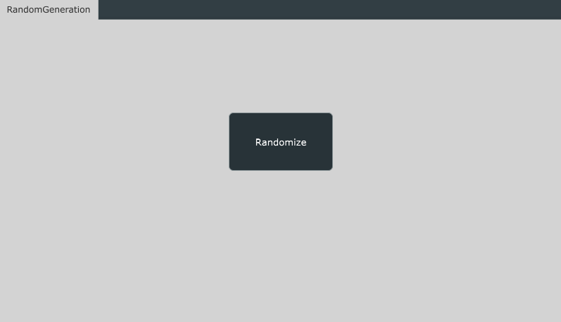
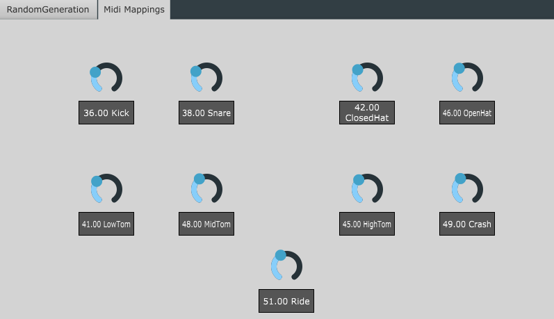
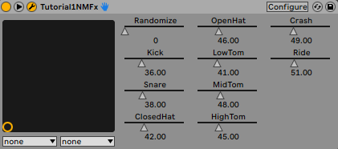

# Tutorial 1 - Random Generation on Button Press
{: .no_toc }

In this tutorial, we will learn how to unconditionaly generate a random drum loop on a button press.
{: .fs-6 .fw-300 }

{: .note }
> the source code for this tutorial is available in the tutorials branch of the repository.
> 
> [Tutorial 1 Source Code](https://github.com/behzadhaki/NeuralMidiFXPlugin/tree/tutorials/1_RandomGenOnButtonPress){: .btn .btn-primary .fs-5 .mb-4 .mb-md-0 .mr-2 }

---

## Model Description
The model we will be using in this exercise is a `VariationalAutoEncoder` (VAE) trained on the [Groove Midi Dataset](https://magenta.tensorflow.org/datasets/groove).

The model has been trained on 2-bar drum loops in 4/4 time signature. 

The model has already been serialized and is available at `TorchScripts/MDL/drumLoopVAE.pt`

### Input/Output Description
The input and output of the model are both 3 stacked tensors of shape (32, 9) where 32 is the number of 16th notes in a 2-bar segment and 9 is the number of drum instruments. 
The three stacked tensors are as follows:
- `hits`: A binary tensor indicating whether or not a drum instrument is hit at a given time step
- `velocities`: A tensor indicating the velocity of the drum instrument at a given time step
- `offsets`: A tensor indicating the offset of the drum instrument at a given time step

### Methods available 
The model has multiple methods available, some of which we will be using in this tutorial. The python
definitions of these models are as follows:

#### 1. encode 
This method encodes a given input pattern into a latent vector. 
The method returns a number of parameters, however the third parameter is the latent vector we are interested in. 

#### 2. sample
This method decodes a given latent vector into an output tensor and returns a `hits`, `velocities`, and `offsets` tensors describing the output pattern.

The input to this method requires a number of additional parameters, however, for the purposes of this tutorial, 
we will not be discussing them.

### Midi Mappings
The 9 voices of the model are as follows:

| Index | Instrument   | Midi Note |
|-------|--------------|-----------|
| 0     | Kick         | 36        |
| 1     | Snare        | 38        |
| 2     | Closed HiHat | 42        |
| 3     | Open HiHat   | 46        |
| 4     | Low Tom      | 41        |
| 5     | Mid Tom      | 47        |
| 6     | High Tom     | 50        |
| 7     | Crash Cymbal | 49        |
| 8     | Ride Cymbal  | 51        |

---

## Plugin Name and Description 

As mentioned [here](https://neuralmidifx.github.io/docs/Installation#step-2-edit-plugin-name-and-description), we need
to specify the name of the plugin as well as some descriptions for it. 

To do this, we will modify the [NeuralMidiFXPlugin/NeuralMidiFXPlugin/CMakeLists.txt](https://github.com/behzadhaki/NeuralMidiFXPlugin/blob/tutorials/1_RandomGenOnButtonPress/NeuralMidiFXPlugin/NeuralMidiFXPlugin/CMakeLists.txt) file as follows:

```cmake
project(Tutorial1NMFx VERSION 0.0.1)

set (BaseTargetName Tutorial1NMFx)

....

juce_add_plugin("${BaseTargetName}"
        COMPANY_NAME "AIMCTutorials"                
        ... 
        PLUGIN_CODE AZCK                # a unique 4 character code for your plugin                          
        ...
        PRODUCT_NAME "Tutorial1NMFx")           # Replace with your plugin title

```

Once you re-build the cmake project, and re-build the plugin, you should see the name of the plugin change in the DAW:



Now we are ready to move on to the next step.

---

## GUI and Parameters

### 1. Placing a button for random generation

As discussed in the [Graphical Interface]({{site.baseurl}}/docs/ParametersAndGUI) section of the documentation, 
to prepare the interface we will need to figure out what UI elements we need as well as how we want to organize them!

For this tutorial, all we need is a single button which will trigger the generation of a random pattern. As such, 
we will modify the [`Configs_GUI.h`](https://github.com/behzadhaki/NeuralMidiFXPlugin/blob/tutorials/1_RandomGenOnButtonPress/NeuralMidiFXPlugin/NeuralMidiFXPlugin/Configs_GUI.h) file as follows:

```c++
namespace Tabs {
        const bool show_grid = true;
        const bool draw_borders_for_components = true;
        const std::vector<tab_tuple> tabList{
            tab_tuple
            {
                "RandomGeneration", // use any name you want for the tab
                slider_list
                {
                },
                rotary_list
                {
                },
                button_list
                {
                    button_tuple{"Randomize", false, "Kh", "Pm"}
                }
            }
        };
    },
    
     namespace MidiInVisualizer {
        const bool enable = false;
        // ....
    }, 
    
    namespace GeneratedContentVisualizer
    {
        const bool enable = true;
        const bool allowToDragOutAsMidi = true;
    }
    
```
{: .note}
> 1. To be able to easily re-position the button on the Gui, Initially we will setting the `show_grid` and `draw_borders_for_components` to true.
> once we have positioned the button, we can set these to false to remove the grid and borders.
> 2. We don't need any drag in features for this tutorial, so we will disable the `MidiInVisualizer` tab.
> 3. We still want to visualize the generations and allow the user to drag them out as midi, so we will enable the `GeneratedContentVisualizer` tab.




Once rendered, if we are happy with the position of the button, we can set the `show_grid` and `draw_borders_for_components` to false.



### 2. Adding rotaries for per voice midi mappings
As mentioned above, the model has 9 voices, each of which is mapped to a midi note. While we could hard-code these mappings,
it would be much more convenient to allow the user to change these mappings from the GUI.

To do this, we will add 9 rotaries to the GUI, each of which will be responsible for changing the midi note of a given voice.

As such, we will add a new tab containing the 9 rotaries to the [`Configs_GUI.h`](https://github.com/behzadhaki/NeuralMidiFXPlugin/blob/tutorials/1_RandomGenOnButtonPress/NeuralMidiFXPlugin/NeuralMidiFXPlugin/Configs_GUI.h) file as follows:

```c++
tab_tuple
            {
                "Midi Mappings",
                slider_list
                {
                },
                rotary_list
                {
                    rotary_tuple{"Kick", 0, 127, 36, "Cc", "Gi"},
                    rotary_tuple{"Snare", 0, 127, 38, "Hc", "Li"},
                    rotary_tuple{"ClosedHat", 0, 127, 42, "Pc", "Ti"},
                    rotary_tuple{"OpenHat", 0, 127, 46, "Uc", "Yi"},

                    rotary_tuple{"LowTom", 0, 127, 41, "Cm", "Gs"},
                    rotary_tuple{"MidTom", 0, 127, 48, "Hm", "Ls"},
                    rotary_tuple{"HighTom", 0, 127, 45, "Pm", "Ts"},
                    rotary_tuple{"Crash", 0, 127, 49, "Um", "Ys"},

                    rotary_tuple{"Ride", 0, 127, 51, "Lt", "Pz"},

                },
                button_list
                {
                }
            }
```

Following the same steps as above, we can re-build the plugin and re-open it in the DAW to see the new tab:



{: .note}
> All of the parameters added to the GUI are automatically detected by the host and can be automated via the DAW
>
> 
> 

---

## Deploy() methods

Remember that there are three `Deploy()` methods that you need to implement:

1. `InputTensorPreparatorThread::deploy()` in [ITP_Deploy.cpp](https://github.com/behzadhaki/NeuralMidiFXPlugin/blob/tutorials/1_RandomGenOnButtonPress/NeuralMidiFXPlugin/NeuralMidiFXPlugin/ITP_Deploy.cpp)
2. `ModelThread::deploy()` in [Model_Deploy.cpp](https://github.com/behzadhaki/NeuralMidiFXPlugin/blob/tutorials/1_RandomGenOnButtonPress/NeuralMidiFXPlugin/NeuralMidiFXPlugin/MDL_Deploy.cpp)
3. `PlaybackPreparatorThread::deploy(}` in [PPP_Deploy.cpp](https://github.com/behzadhaki/NeuralMidiFXPlugin/blob/tutorials/1_RandomGenOnButtonPress/NeuralMidiFXPlugin/NeuralMidiFXPlugin/PPP_Deploy.cpp)

In this tutorial, given that we are not using any input midi, we will only need to implement the `ModelThread::deploy()` and `PlaybackPreparatorThread::deploy(}` methods.

### ModelThread::deploy()

#### Load the model

The very first step in here is to load the model if it has not been loaded already.  

To do this, we will add the following code to the `ModelThread::deploy()` method:

```c++
    // =================================================================================
    // ===         0. LOADING THE MODEL
    // =================================================================================
    // Try loading the model if it hasn't been loaded yet
    if (!isModelLoaded) {
        load("drumLoopVAE.pt");
    }
```

#### Check if random generation button is pressed

To check if the button is pressed, we will be using `gui_params` which is a member of the `ModelThread` class.

Here we will check if the button has been clicked and if so, we will print a message to the console 

```c++
    // =================================================================================
    // ===         1. ACCESSING GUI PARAMETERS
    // Refer to:
    // https://neuralmidifx.github.io/datatypes/GuiParams#accessing-the-ui-parameters
    // =================================================================================
    auto ButtonTrigger = gui_params.wasButtonClicked("RandomGeneration");
    if (ButtonTrigger) {
        PrintMessage("ButtonTriggered");
    }
    // =================================================================================

```


