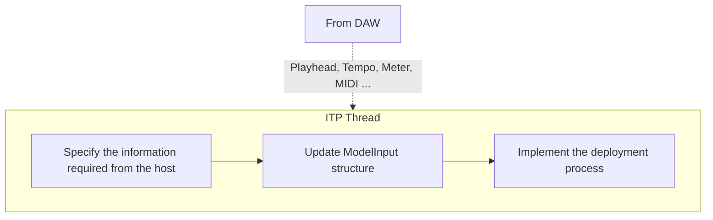

# Input Tensor Preparator Thread (ITP)
{: .no_toc }

{: .fs-6 .fw-300 }

## Table of contents
{: .no_toc .text-delta }

1. TOC
{:toc}

{: .note }
> For this Stage of Deployment, You should modify the following file
> 
> [Configs_HostEvents.h](https://github.com/behzadhaki/NeuralMidiFXPlugin/blob/master/NeuralMidiFXPlugin/NeuralMidiFXPlugin/Configs_HostEvents.h){: .btn .btn-primary .fs-5 .mb-4 .mb-md-0 .mr-2 }

---

## Specification of the Information Required from the Host
Prior to running the inference on a given model, all or some of the host`s play-head information,
incoming MIDI messages, and possibly parameters controlled via a graphical interface must be 
reformatted according to a given model`s input requirements. `ITP` thread is responsible for
this task.

In this thread, all necessary information is sequentially provided to carry out the tokenization 
(or representation) of the 
relevant symbolic information into a tensor-like format. 

## Specification of the Information Required from the Host

Depending on the task at hand, the type of information as well as the frequency at which they are 
required may vary. For instance, in the case of a model that only requires the onset of notes with 
their corresponding time-stamp, the `ITP` thread will only require the Note On MIDI Messages. On the
other hand, for a model that requires the full MIDI messages as well as bar/beat, meter information, the
`ITP` thread will require to receive extra information from the host (namely, the MIDI messages and 
the bar/beat information). NeuralMidiFx allows you to easily specify the subset of 
the information you need from the host.

{: .note }
> Edit the [`Config_HostEvents.h` file]({{ site.baseurl }}/docs/DeploymentThreads/Config_HostEvents) to specify the information required from the host.

### Available Events
In this context, an event is a piece of information that is sent to the `ITP` thread notifying it of a
change in the host`s state or a new incoming MIDI message.

The available events are:

- `FirstBufferEvent` --> The very first event sent by the host when the playhead starts.
This event is useful to figure out when the host starts playing.
- `PlaybackStoppedEvent` --> The event sent by the host as soon as the playhead stops. 
This event is useful to figure out when the host stops playing.
- `NewBufferEvent` --> The event sent by the host at the beginning of every new buffer (if playhead is running).
In case you have a specific model that requires to know the position of the playhead at any given time, 
use this event. (See [Plugin Basics]({{ site.baseurl }}/docs/PluginBasics/#processor) chapter if you are not familiar with the concept of buffer)
- `NewBarEvent` --> The event sent by the host at the beginning of every new bar (if playhead is running).
In case you use bar locations in your tokenization process, use this event.
- `NewTimeShiftEvent` --> The event sent by the host every N quarter notes (if playhead is running).
In case you use specific locations (such as every beat, every 16th note, etc.) in your tokenization process,
use this event. 
- `NoteOnEvent` --> The event sent by the host when a note is played.
- `NoteOffEvent` --> The event sent by the host when a note is released.
- `CCEvent` --> The event sent by the host when a CC message is received.

### Modifying `Config_HostEvents.h`

To modify the 

| Setting Name                                | Description                                                                                               |
|---------------------------------------------|-----------------------------------------------------------------------------------------------------------|
| SendEventAtBeginningOfNewBuffers_FLAG       | Send the metadata over to ITP whenever a new buffer arrives                                               |
| SendEventForNewBufferIfMetadataChanged_FLAG | Only send if the buffer status changes (i.e. tempo changes, meter changes. ...)                           |
| SendNewBarEvents_FLAG                       | Notify the beginning of a new bar.                                                                        |
| SendTimeShiftEvents_FLAG                    | Event from host at specific ratios of quarter notes (specified by delta_TimeShiftEventRatioOfQuarterNote) |
| FilterNoteOnEvents_FLAG                     | Filter Note On Events if not needed.                                                                      |
| FilterNoteOffEvents_FLAG                    | Filter Note Off Events if not needed.                                                                     |
| FilterCCEvents_FLAG                         | Filter CC Events if not needed.                                                                           |

