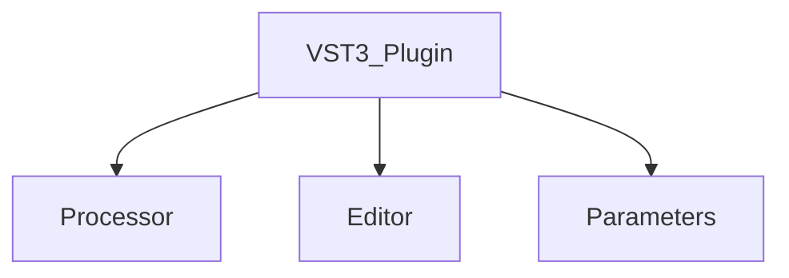

# Plugin Basics
{: .no_toc }

In this section, we will provide a brief guide on general VST plugin architecture and how a plugin interacts with the host
{: .fs-6 .fw-300 }

## Table of contents
{: .no_toc .text-delta }

1. TOC
{:toc}

[View it on GitHub][Just the Docs repo]{: .btn .fs-5 .mb-4 .mb-md-0 }

---

## VST3 Plugin Architecture

### Processor
The processor is the core of any VST3 plugin, responsible for audio and MIDI processing. 
It's the part that performs the actual computations on the incoming audio/midi, manipulating it according to the parameters set by the user or the host application. 

The communication between a VST3 plugin and a compatible host is done on a per-buffer basis. 
In the processor thread, the host provides a buffer of audio/midi data to the plugin, and the plugin is expected to process the data and return a buffer of audio/midi data back to the host.
The processing is done in a per-buffer basis, and the plugin is expected to process the data within a limited amount of time, as the processing method 
is called repeatedly by the host as soon as a new buffer of data is available.
Given the limited amount of time available to process the data, there is only so much that can be done within the processing method.
As a result, intensive computations (such as generation using a neural network) must be carried out in the background using a separate thread.

In addition to MIDI and audio data, the host also provides the plugin with information about the current state of the plugin, such as the current value of each parameter, the playhead position, 
sample rate, meter, time signature and so on. Given that the data is not provided per-sample (but rather per-buffer), the smallest resolution at which  
these data is available is the buffer size. 

Using the playhead information, the plugin can determine the current position in the timeline. This position is 
relative to the start of the timeline and can be accessed in different time units:

- **Samples**: The number of samples since the start of the timeline.
- **Seconds**: The number of seconds since the start of the timeline.
- **Quarter Notes**: The number of quarter notes since the start of the timeline.

With respect to MIDI data within a buffer, the host provides the exact location of the event within the buffer. 
That said, this location is always specified in **samples relative to the start of the buffer**.

Depending on what sort of timing a generative model requires, a developer should use the provided timing information to calculate the appropriate timing for the model.

{: .note }
> If you want to learn more about VST3 plugin development using JUCE, check out the 
> following tutorial provided by [Eyal Amir](https://github.com/eyalamirmusic) on the [The Audio Programmer](https://www.youtube.com/@TheAudioProgrammer) YouTube channel:
> <iframe width="560" height="315" src="https://www.youtube.com/embed/tgf6J8foCiw" title="YouTube video player" frameborder="0" allow="accelerometer; autoplay; clipboard-write; encrypted-media; gyroscope; picture-in-picture; web-share" allowfullscreen></iframe>
> 

#### `Animation of the Buffer Information`

<video width="85%" preload="auto" muted controls>
    <source src="{{ site.baseurl }}/assets/videos/BufferDAW0.mp4" type="video/mp4"/>
</video>

#### `Animation of Processing a Buffer In the Plugin`

<video width="85%" preload="auto" muted controls>
    <source src="{{ site.baseurl }}/assets/videos/BufferDAWProcessBlock.mp4" type="video/mp4"/>
</video>

### Editor
The editor in a VST3 plugin represents the graphical user interface (UI). 
It's what the user interacts with when adjusting parameters and settings. 
The editor is responsible for rendering the UI and handling user input.

The editor is not required for a VST3 plugin to function, but it's highly recommended to include one.
Without an editor, the plugin will be displayed as a generic window with no controls, which is not ideal for the user experience.

Designing a good UI is a challenging task that requires careful consideration of the plugin's functionality and the user's needs.
UI implementation is a complex process that involves several steps:
- **Graphical Elements**: Creating an engaging and intuitive user interface requires careful design of graphical elements. These can include knobs, sliders, buttons, and displays, each corresponding to a specific parameter in the plugin.
- **Parameter Mapping**: Parameter mapping bridges the graphical elements with the internal parameters of the plugin. 
- **Preset Management**: Preset management allows users to save and recall specific settings, known as presets. This feature is vital for workflow efficiency, enabling users to quickly switch between different configurations and reuse them across various projects.
- **Automation**: Automation refers to the ability of the host to control plugin parameters automatically over time. 

{: .warning }
> The editor is only constructed when the plugin user interface is opened. This means that the editor is closed. 
> As a result, no significant processing should be done in the editor. Also, correct mechanisms should be implemented 
> to ensure that the editor restores its state correctly when it's reopened (i.e. reconstructed)

## Challenges of Deploying NN-based Generative Models of Symbolic Music as VST3 Plugins
Deploying Neural Network (NN) based generative models within VST3 plugins adds layers of complexity and introduces unique challenges.

### Unavoidable Multi-threaded Implementation
As mentioned earlier, the processing method is called repeatedly by the host as soon as a new buffer of data is available.
Given the computational complexity of NN-based models, it is essential to run many processes involved in the generation on a separate thread:

#### Computational Resources and Performance
NN-based models are computationally intensive and require significant processing power. 
This can be a challenge when deploying them as VST3 plugins, as the host application may not have the necessary resources to run the models in real time.
This is especially true for models that require GPU acceleration, 
as GPU acceleration is rarely exploited in plugin applications (a recent example of GPU accelerated VST3 plugins is [GPU Audio](https://www.gpu.audio/beta-suite)).

{: .note }
> A plugin does not necessarily need to run in real time. Even if your model is not intended to run in real time, 
> it is still possible and very valuable to deploy it as a VST3 plugin. 

#### Data Preprocessing and Postprocessing
Handling the conversion between raw MIDI data and the specific format required by the generative models is a complex and potentially costly task. 
It requires careful mapping, scaling, and encoding, all of which can be challenging to implement correctly. 

### Compatibility and Stability
Ensuring compatibility and stability with various hosts and platforms becomes even more complex when dealing with NN models. 
Different systems may have varying support for the underlying technologies required to run the models, and developers must account for these variations to ensure a smooth user experience.

### Deployment Language Barriers
Most NN-based generative models are implemented in Python, which is not a supported language for VST3 plugin development.
This means that developers must find a way to deploy their models in a supported language, such as C++.
